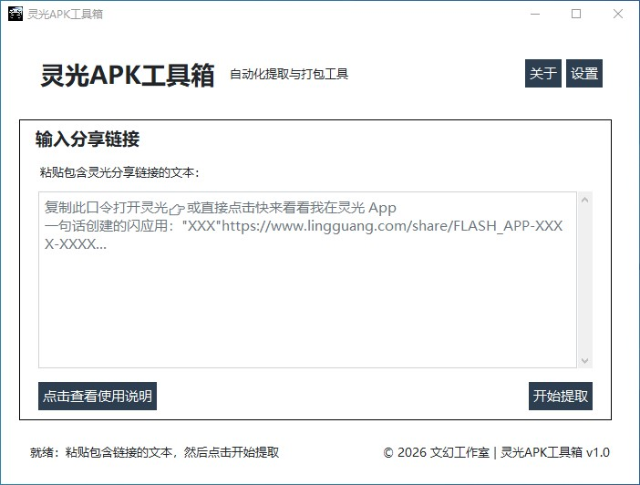
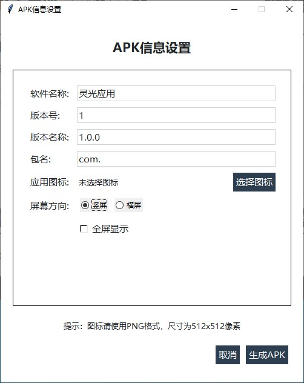

# 灵光APK工具箱

[](https://opensource.org/licenses/MIT)
[](https://www.python.org/)

一款自动化提取灵光闪应用网页内容并转换为APK应用的工具，简化您的开发流程。

## 项目简介

灵光APK工具箱是一款专为灵光平台用户设计的桌面应用程序。它能够自动提取灵光闪应用的网页内容，并将其打包成独立的Android APK应用，让您能够在移动设备上使用这些应用。

## 软件截图

### 主界面


### 进度界面


### 打包界面


## 功能特性

- **智能链接提取**：自动识别并提取灵光分享链接中的网页内容
- **APK打包**：将提取的网页内容转换为可安装的Android APK应用
- **自定义应用信息**：支持设置应用名称、版本号、包名等信息
- **图标自定义**：支持自定义应用图标
- **自动签名**：内置签名证书，自动为生成的APK进行数字签名
- **用户友好界面**：简洁直观的图形化界面，操作简单
- **可配置参数**：支持调整等待时间等参数
- **免责声明**：内置用户协议和免责声明，确保合规使用

## 安装说明

### 系统要求

- **操作系统**：Windows 10/11
- **Python版本**：3.7 或更高版本
- **依赖库**：tkinter, PIL, playwright, ttkbootstrap

### 安装步骤

1. **克隆仓库**
   ```bash
   git clone https://github.com/aTRbFAc/lingguang-apk-toolbox.git
   cd lingguang-apk-toolbox
   ```

2. **安装依赖**
   ```bash
   pip install -r requirements.txt
   ```

3. **安装Playwright浏览器**
   ```bash
   playwright install chromium
   ```

4. **运行应用程序**
   ```bash
   python main.py
   ```

## 使用方法

### 基本使用流程

1. **启动应用程序**
   - 双击运行 `main.py` 或在命令行中执行 `python main.py`

2. **阅读并同意免责声明**
   - 首次运行时会显示免责声明和用户协议，请仔细阅读并同意

3. **输入分享链接**
   - 在主界面中粘贴包含灵光分享链接的文本

4. **开始提取**
   - 点击"开始提取"按钮，系统将自动解析链接并提取内容
   - 提取过程中会显示进度条和状态信息

5. **保存HTML文件**
   - 提取完成后，选择保存位置保存HTML文件

6. **打包APK（可选）**
   - 点击"打包成APK"按钮进入APK信息设置界面
   - 填写应用信息（名称、版本、包名等）
   - 选择应用图标（可选）
   - 点击生成APK

### 详细使用说明

#### 提取内容
- 复制灵光应用右上角"···"菜单中的分享链接
- 将链接粘贴到输入框中
- 点击"开始提取"开始处理

#### APK设置
- **软件名称**：应用的显示名称
- **版本号**：整数版本代码
- **版本名称**：字符串版本名称（如1.0.0）
- **包名**：应用的唯一标识符
- **应用图标**：PNG格式图标文件

## 项目结构

```
灵光APK工具箱/
├── main.py                # 主程序入口，GUI界面
├── py/
│   ├── config.py          # 配置文件管理
│   ├── extract_iframe.py  # 网页内容提取模块
│   ├── Generate_apk.py    # APK生成模块
│   └── signature.py       # APK签名模块
├── apk_template/          # APK模板文件
├── resources/             # 资源文件
├── key/                   # 签名证书
├── icon/                  # 应用图标
├── images/                # 界面图片资源
├── Screen/                # 软件截图
├── config.json            # 配置文件
├── requirements.txt       # Python依赖
└── README.md              # 项目说明
```

## 技术栈

- **GUI框架**：tkinter + ttkbootstrap
- **网页自动化**：Playwright
- **APK处理**：apktool
- **签名工具**：apksigner
- **图像处理**：Pillow

## 配置说明

应用程序使用 `config.json` 文件存储配置信息：

```json
{
    "wait_time": 20  // 网页加载等待时间（秒）
}
```

## 注意事项

1. **合规使用**：请确保您有权处理的相关内容，遵守相关法律法规
2. **网络环境**：确保网络连接稳定，提取过程需要访问互联网
3. **Android环境**：生成的APK需要在Android设备上安装测试
4. **功能限制**：部分依赖灵光API的功能可能在离线APK中无法正常工作

## 问题反馈

如果您在使用过程中遇到问题，请：
1. 查看控制台输出的错误信息
2. 检查网络连接和权限设置
3. 联系开发者获取帮助

## 许可证

本项目采用 MIT 许可证 - 查看 [LICENSE](LICENSE) 文件了解详情

## 贡献

欢迎提交 Issue 和 Pull Request 来改进这个项目！

## 联系我们

- **开发团队**：文幻工作室
- **邮箱**：atrbfac@163.com
- **QQ交流群**：981642484
- **官方网站**：[https://atrbfac.top](https://atrbfac.top)

---

**© 2026 文幻工作室 版权所有**
